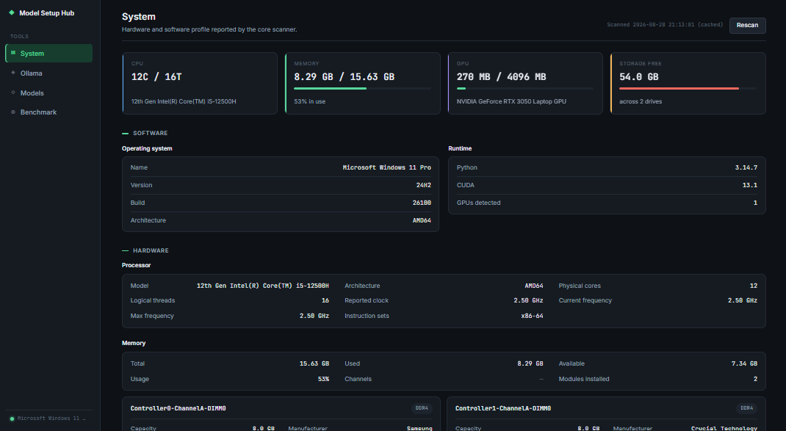
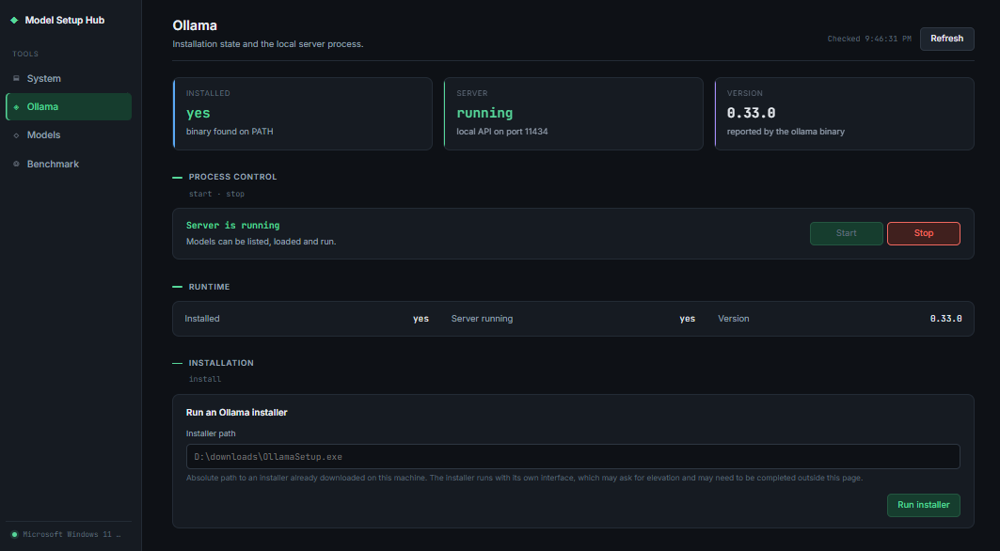
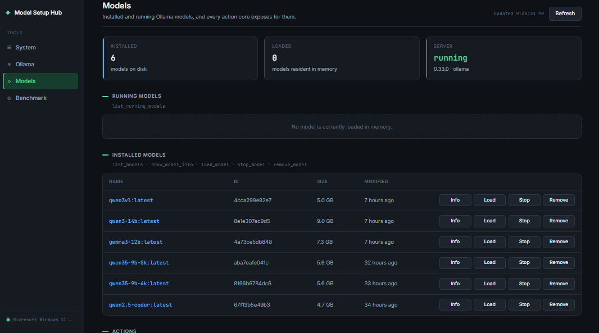
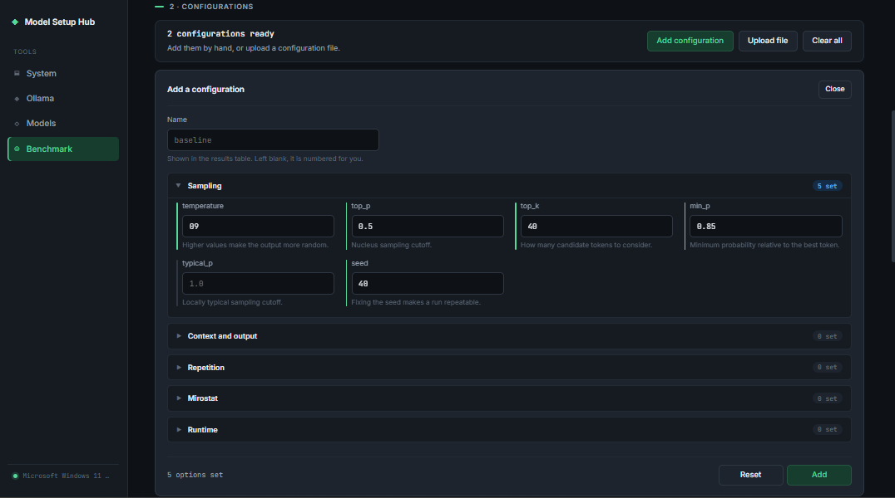
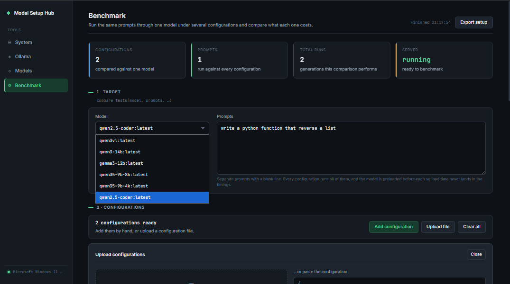
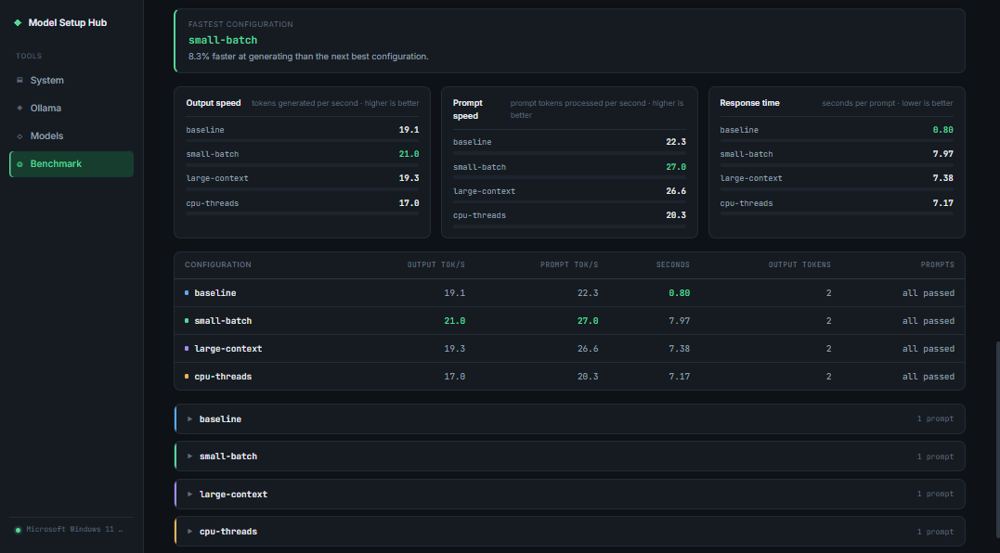

# Model Setup Hub — Web GUI

A local web interface for the [ModelSetupHub Core](https://github.com/ModelSetupHub/Core) toolkit. Every button on this
dashboard calls one core function directly, so you keep full control over what runs on your machine — inspect hardware,
manage the Ollama runtime, work with local models, and benchmark generation parameters against each other.

فارسی: [README.fa.md](README.fa.md)



## Who this is for

Model Setup Hub ships the same toolkit through two front ends, and they are meant for different people:

- **This repository (Web GUI)** — for users who already know what they want to do. You choose the model, the parameters
  and the order of operations yourself. Nothing is decided for you, which makes the work faster and more precise, but it
  assumes you understand what a context window or a GPU layer count means.
- **The MCP server** — for users who would rather describe the goal in plain language and let an AI agent drive the same
  tools. If you are not sure which model fits your hardware, or which parameters to change, use that one instead.

Both talk to the identical `core` package, so they can be used interchangeably on the same machine.

## What the dashboard does

The interface is a single page with four tabs down the left side.

### System

A full hardware scan: CPU, RAM modules, GPUs with VRAM, disks with usage bars, and OS details. A scan shells out to
PowerShell and `nvidia-smi` and takes several seconds, so the result is cached in memory — press **Refresh** to force a
new one. Use this tab first: the VRAM figure here is what decides which models you can actually load.

### Ollama



Installation state and the local server process. Start and stop the server, read its version, and run an installer that
is already downloaded on the machine.

One behaviour worth knowing: on Windows the Ollama desktop app supervises the server and restarts it immediately after a
kill. When that happens the page says so explicitly rather than claiming a stop that did not stick — quit Ollama from the
system tray if you need it to stay down.

### Models



Everything core exposes for models: the installed list and the in-memory list, plus per-row **Info**, **Load**, **Stop**
and **Remove**. Below the tables are four forms — run a single prompt, load a model with a `keep_alive` window, register
a local GGUF file, and create a configured copy of an existing model.

The last form is worth distinguishing from the Benchmark tab: `configure_model` writes a Modelfile and creates a **new
model on disk**. The source model is never touched. Removing a model is not recoverable from this interface, so it asks
for confirmation first.

Every action reports itself in three places at once — the Output panel at the bottom of the tab keeps the full text
result, a toast tracks progress in the corner, and the button that triggered it shows a spinner.

### Benchmark

This is where the tab differs most from the others. It runs the same prompts through one model under several parameter
sets and compares the cost of each, so you can decide which configuration to keep.

**Step 1 — Target.** Pick the model, then write the prompts. Prompts are separated by a **blank line**, which keeps a
multi-line prompt intact while still allowing several of them. Every configuration runs all of the prompts, and the model
is preloaded before each one so load time never lands in the timings.

**Step 2 — Configurations.** Add them in either of two ways.

*By hand* — a form covering 23 Ollama generation options, grouped into Sampling, Context and output, Repetition,
Mirostat and Runtime. An empty field means "leave the model's default alone" and is never sent, which is why booleans are
a three-way select rather than a checkbox: `not set` and `false` are different things to Ollama. A field holding a value
is tinted, and each collapsed group reports how many of its options are set.



*From a file* — drop a `.json` file on the drop zone, pick one with the file browser, or paste the text. The file is
validated on the server first and you get a preview of what was understood, then choose **Add to list** or **Replace
existing**. Applying is a separate step on purpose: a file may also carry a model and prompts, and those should not
silently overwrite what you already typed.



Four document shapes are accepted:

```jsonc
// a whole setup
{ "model": "...", "prompts": ["..."], "configurations": [ ... ] }

// just a list of configurations
[ { "name": "baseline", "options": { "temperature": 0.7 } } ]

// a single configuration
{ "name": "baseline", "options": { "temperature": 0.7 } }

// a bare options mapping — gets numbered for you
{ "temperature": 0.7, "num_ctx": 4096 }
```

Keys the app does not recognise are passed through untouched rather than rejected, so a file written for a newer Ollama
server still works here. **Export setup** writes the current model, prompts and configurations back out as a file you
can re-upload later.

Each configuration card offers **Edit**, **Duplicate** and **Remove**. Duplicate is how you build a variant: keep
everything, change one option. That is also the advice for getting meaningful numbers — if two configurations differ in
several places you cannot attribute the difference to any one of them. Set `seed` to a fixed value so runs are
repeatable, and vary one parameter at a time.

**Step 3 — Run.** The status bar states why it is not ready yet (`no prompts were written`, `no configurations were
added`) and locks the whole setup while a run is in flight, because the run already holds its own copy of it. Only one
comparison runs at a time: two at once would contend for the same GPU and make every timing in both meaningless.

Comparisons take minutes, so they run in a background thread on the server and the page polls for the outcome. Reloading
the browser does not lose a run in progress — the job lives on the server and the page picks it back up.

**Results.** The verdict comes first: which configuration generated fastest and by how much over the runner-up. Then
three bar blocks — output speed, prompt speed, response time — each scaled against the best value in its own block, with
the scale inverted for response time so the best value fills the track in all three. Then a summary table with the
winning cell in each column highlighted, and finally a collapsible detail per configuration with per-prompt timings and,
if **Keep generated text** was ticked, the generated output itself.



A failed prompt is reported rather than hidden: the row says how many failed and the detail panel carries the error text
straight from Ollama, which is usually what you need — an out-of-memory during startup, a CUDA initialisation failure,
and so on.

## Requirements

- Python 3.10 or newer
- Windows — the hardware scanner uses PowerShell and WMI
- [Ollama](https://ollama.com/) installed, for everything except the System tab
- Git, to fetch the core submodule

## Setup

`core` is a git submodule, not a copy of the code, and it has to be installed as a package before the app can import it.
Both steps are required.

```bash
# 1. clone with the submodule
git clone --recurse-submodules https://github.com/ModelSetupHub/gui.git
cd gui

# already cloned without --recurse-submodules? fetch it now:
git submodule update --init --recursive
```

```bash
# 2. a virtual environment is recommended
python -m venv .venv
source .venv/Scripts/activate     # Git Bash on Windows
# .venv\Scripts\activate          # PowerShell / cmd
```

```bash
# 3. install the core submodule as an editable package, then the web dependencies
pip install -e ./core
pip install -r requirements.txt
```

```bash
# 4. run it
python app.py
```

Open <http://127.0.0.1:5000/>.

The `pip install -e ./core` step is the one that is easy to miss. Without it every request fails with
`ModuleNotFoundError: No module named 'core'`, because `app.py` imports the submodule by package name rather than by
path.

## Notes on running it

The dev server runs with `debug=True` on port 5000 and binds to localhost only. It has **no authentication**, and its
endpoints start Ollama, load and remove models, and execute installers on the host. Do not expose it on a network
interface or put it behind a public reverse proxy as it stands.

Two pieces of state live in the server process rather than on disk: the cached hardware scan and the current benchmark
job. Restarting the server discards both. Configurations you build in the Benchmark tab live in the browser page — use
**Export setup** if you want to keep them.

## Project layout

```text
gui/
├── app.py                       # entrypoint; builds and starts the app
├── requirements.txt
├── core/                        # git submodule → ModelSetupHub/Core
├── webapp/
│   ├── __init__.py              # create_app, blueprint registration
│   ├── responses.py             # shared JSON envelope, core-exception translation
│   ├── routes/                  # one blueprint per feature area
│   │   ├── pages.py             # serves the dashboard
│   │   ├── system.py            # /api/system
│   │   ├── runtime.py           # /api/ollama/{status,start,stop,install}
│   │   ├── models.py            # /api/ollama/models/*
│   │   └── benchmark.py         # /api/benchmark/*
│   ├── services/                # state that outlives a request
│   │   ├── system_scan.py       # cached hardware profile
│   │   └── benchmark.py         # background comparison job
│   └── parsing/                 # external text → renderable structures
│       ├── ollama_text.py       # Ollama CLI tables and `show` output
│       ├── benchmark_options.py # the option schema the form is built from
│       └── benchmark_config.py  # configuration validation and file parsing
├── templates/
│   ├── base.html                # shell: head, sidebar, toast host
│   ├── dashboard.html
│   ├── partials/sidebar.html
│   └── sections/                # one file per tab
├── static/
│   ├── css/                     # tokens, layout, components
│   └── js/
│       ├── main.js              # binds every panel, then loads their data
│       ├── lib/                 # api, actions, state, toast, console, format
│       └── panels/              # one controller per tab
└── docs/screenshots/
```

Every API endpoint answers with the same envelope, so the browser has one code path for success and failure:

```json
{ "ok": true, "error": null, "data": "..." }
```

Core raises `ValueError`/`TypeError`/`FileNotFoundError` for bad input and `RuntimeError` when Ollama itself fails; the
first group maps to HTTP 400 and the rest to 500. Where Ollama's own explanation only survives on a chained exception
cause, it is read back and appended to the message.

## License

See the [core repository](https://github.com/ModelSetupHub/Core) for licensing.
